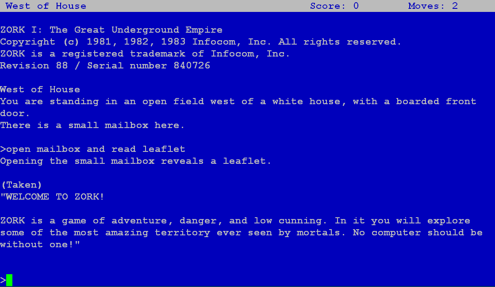

# A2Z Machine

The A2Z Machine is a Z Machine port to Arduino for playing Zork and other compatible interactive fiction games. It was developed to work with the Adafruit M4 ItsyBitsy Express microcontroller (https://www.adafruit.com/product/3800) with no additional hardware or soldering needed. This project is based on the JZip 2.1 project at http://jzip.sourceforge.net/

For a complete description of the project, visit:

http://danthegeek.com/2018/10/30/a2z-machine-running-zork-on-an-adafruit-itsybitsy-m4-express/

## Quick Start Guide

In addition to code from this GitHub library for the A2Z Machine, you will also need the following libraries installed:

- Adafruit SPIFlash Library - https://github.com/adafruit/Adafruit_SPIFlash
- Adafruit QSPI Library - https://github.com/adafruit/Adafruit_QSPI
- mcurses Library - https://github.com/ChrisMicro/mcurses
- TinyUSB Library - (new for version 2) https://github.com/adafruit/Adafruit_TinyUSB_Arduino

When compiling the sketch, you must select the "Tools | USB Stack | TinyUSB" option in the Arduino IDE menu.

Create a sketch called "a2z_machine" and copy the project files into the folder. Compile and upload the sketch to the ItsyBitsy.

New in version 2, A2Z machine now acts as a USB thumb drive, allowing you to drag and drop game files onto the device directly. You can also manage saved games, including copying saved games to and from the device.

To initialize the filesystem, create 2 folders from the root folder of the device with the following names:

- "stories"
- "saves"

The stories folder will contain the Z Machine game files, and the saves folder will contain saved games. Copy the story files from the games folder in the library to the stories folder on the device. 

Use a terminal emulator to play the game (i.e. PuTTY for Windows). BAUD rate should be set to 9600, no local echo. Select the implicit CR in every LF setting.

